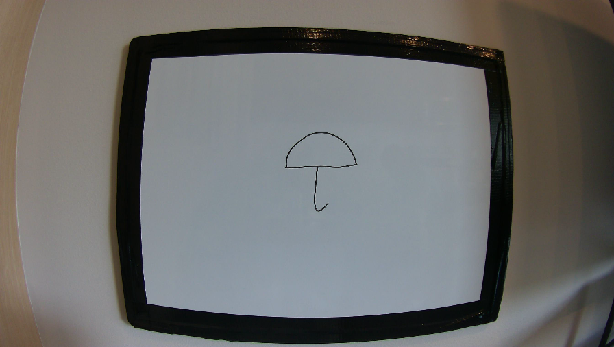
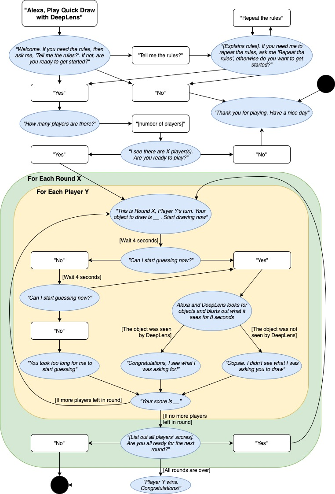

URL: https://aws.amazon.com/blogs/machine-learning/building-a-pictionary-style-game-with-aws-deeplens-and-amazon-alexa/

This is a Guess My Drawing game sponsored by Amazon AWS DeepLens. 

Guess My Drawing is an interactive drawing game between players and an Alexa echo device. An Amazon AWS DeepLens will capture what a player draws on a whiteboard or a white paper and inference the drawing to the most relevant object. This game is a great way for developers who are interested in deep-learning applications with DeepLens and exploring AWS services and how to connect DeepLens with Alexa Skills.

The game is designed in AWS using AWS Lambda, AWS S3, Alexa Skill, AWS Kinesis Stream. The project is broken down into two main lambda functions:
1) A DeepLens lambda function that handles getting input images captured from the AWS DeepLens and performs preprocessing on the input images to feed the deep-learning shape detection model. 

       --------->         

2) An Alexa Skill lambda function that handles all the logics for the interactions between Alexa and the player. It works as a bridge to connect the output of the previous lambda function and Alexa Skill together. The logics of the game are shown in the image below

   
